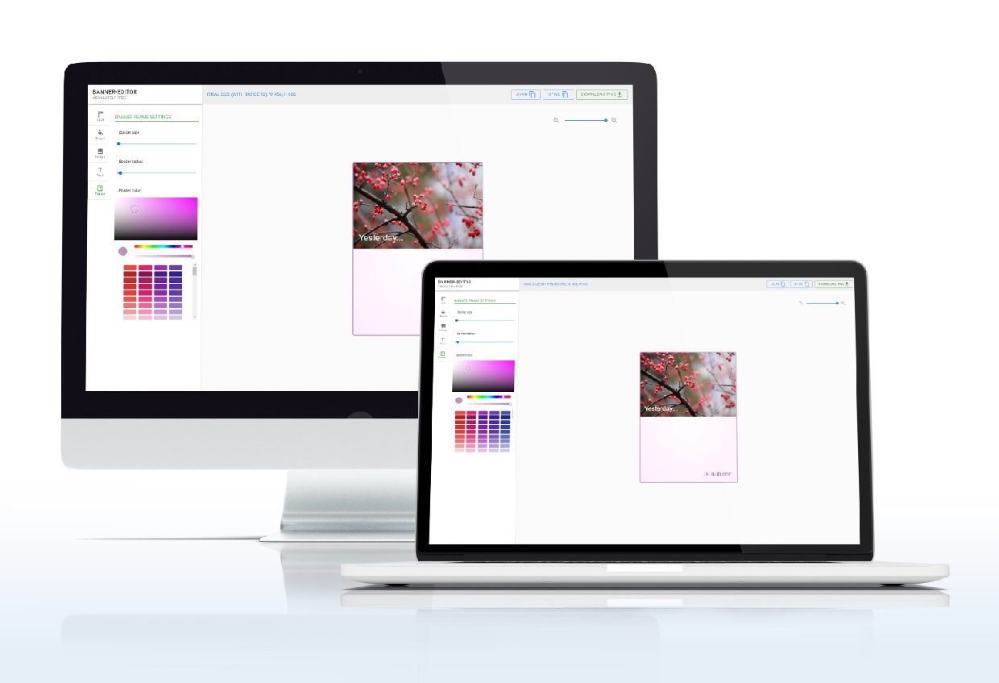

# banner-editor. Редактор баннеров

## <a href="https://banner-editor-31e75.web.app/">Ссылка на приложение</a>



## Banner-editor

Приложение для быстрого создания баннеров на фреймворке Vue.
На данный момент, при экспорте баннера в HTML, ссылка на изображение работает только 24 часа!

### Возможности:

- Изменение размера баннера
- Фон: сплошной цвет или градиент
- Вставка изображения: с устройства пользователя или по ссылке
- Текст: вставка текстовых модулей, в необходимом количестве. Изменение цвета, размера, шрифта, веса текста
- Рамка: регулировка цвета, толщины и радиуса скругления
- Масштаб: для работы с большими размерами баннера
- Скачивание в виде файла
- Копирование в буфер: текущих настроек баннера, баннер как HTML код
- Отображение текущего размера баннера, включая толщину рамки

### При разработке пользовался:

- Vue
- Vuex
- Vuetify
- Vue-cli
- Firebase (хостинг)
- CSS фреймворк SASS
- Vue-Konva
- Dom-to-image
- Vuelidate
- Vue-clipboard2

## Настройка проекта и установка необходимых пакетов

```
npm install
```

### Компиляция и запуск на localhost:3999

```
npm run serve
```

### Компиляция и минимизация

```
npm run build
```
